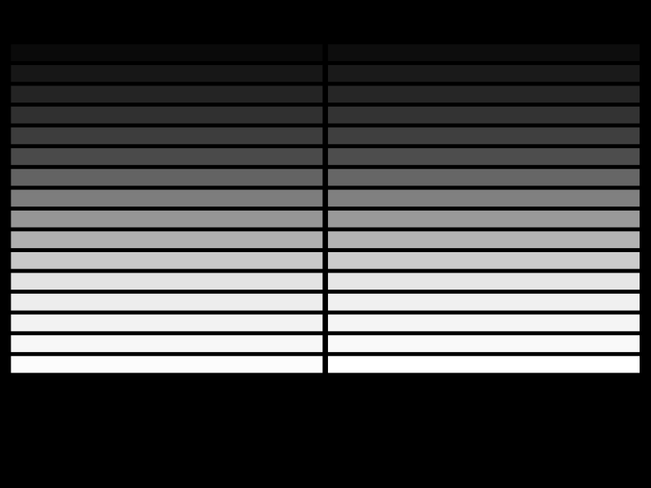
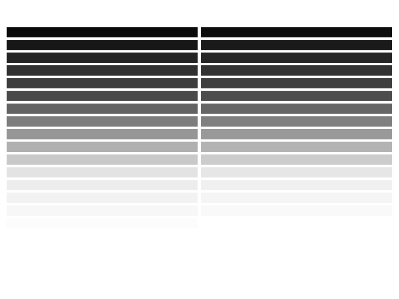

Sleep monitoring
==========================

This file explains how to generate data (time,position ...) from a video acquiered using the sleep monitors.
It also explains how monitoring can be done in real time, using the pi camera.

Installing pysolovideo package.
---------------------------------

At the moment, the package is still under development, so you need to

1. clone psv repo (https://github.com/gilestrolab/pySolo-Video/)
2. switch to the package branch (`git checkout psv-package`)
3. `cd src`
4. use `pip` to install the package: `# pip2 install -e .`

Ensure you can install packages with pip and that you are using **`python2` (hence `pip2`)**

Running the sleep monitoring script on pre-recorded video
-------------------------------------------------------------

First, since there is no automask yet, you need to create a mask for the video.
A mask is an image with a black (0,0,0) background where every region of interest is outlined in a different value of grey.
Ideally, the values of grey are in a sensible order (e.g. matching spatial order).
Here is an example:


I generally make them in inkscape since it is really simple to align rectangles.
Here is a template (change the backgrounf to black):


Then, if my mask is saved at `~/Desktop/mask_model.png`, and my video at `/stk/pysolo_video_samples/monitor_exple.avi`, I can run:

```
cd scripts
python2 sleep_monitor_pi.py -o /tmp/test.csv --mask ~/Desktop/mask_model.png  --video /stk/pysolo_video_samples/monitor_exple.avi
```

This would generate a result file in `-o /tmp/test.csv`.
See `python2 sleep_monitor_pi.py --help` for more options


Running the sleep monitoring script on the fly
-------------------------------------------------------------

If you do not specify a video device, the input video will be assumed to come from the first video device.
This uses V4L2, so, if you are using a pi, ensure you have the required modules installed (see https://github.com/gilestrolab/pySolo-Video/blob/psv-package/scripts/post-arch-pi.sh).

```
python2 sleep_monitor_pi.py -o /tmp/test.csv --mask ~/Desktop/mask_model.png
```

Processing the output
-------------------------------------------------

The output format is a unique dataframe (in a csv file):
it has a header row describing the variable, and every row correspond to one measurment.

The important fields (columns) are:

* `t`, the time in seconds
* `x` and `y`, the x and y coordinates. This is relative to the length longest axis of the ROI (i.e. For a ROI like the ones in the example mask, `x=0` is at the very left whilst `x=1` is at the rightmost)
* `roi_idx` and `roi_value`, which ROI does a measurement comes from.


Reading and processing this sort of data is simple with `pandas` or `R`.
For instance, in R, if you want to plot the time versus the x position for the first ROI (the one at the top-left):

```R
# read the file
df <- read.csv("/tmp/test.csv")

# only keep one ROI (idx = 0 >==>  top left)
dfss <- subset(df, roi_idx==0)

# plot  time vs x
plot(t ~ x  , dfss, type="l")
```

